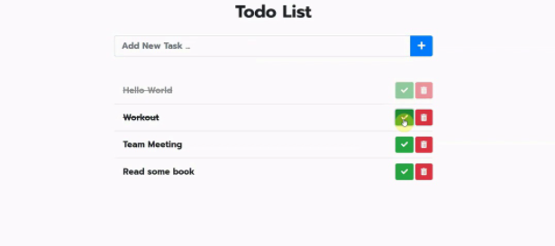

# Primer Parcial 20%

**Modalidad:** virtual - individual

**Descripción:** 
Desarrollar un ToDoList en el cual el usuario debe poder agregar al listado y tachar o agregar un indicador que x tarea se ha realizado, pueden haber diferentes variantes, por ejemplo que cada item que se agrega cambie de color, o se agregue un emoji al final si ya esta finalizada, simplemente se tache o se remueva el item, incluso el usuario puede editar una tarea. 

 A continuación se presenta un ejemplo de ToDoList: 

- [ ] Hacer tarea
- [x] Ingresar a sesión síncrona
- [ ] Salir de excursión 
- [ ] Comprar la cena 
- [ ] Etc.
  
 

**Funciones principales:**
1. Agregar
2. Editar 
3. Eliminar

**Tecnologías a utilizar**
 - HTML
 - CSS 
 - JS
  
**Importante**
~~~  
No utilizar frameworks o librerías para el desarrollo.
Investigar e implementar LocalStorage (opcional).
Subir una foto de su persona al perfil de Moodle y  la misma foto a su perfil de Github, importante para poder ser calificada su tarea. 
~~~

**Rúbrica**

| Criterios      | 10                                                     | 9 - 7                                            | 6 ...0                                         |
| ---------------|----------------------------------------------------    |--------------------------------------------------|----------------------------------------------- |
| Funciones      | Realiza todas las funciones: agregar, editar, eliminar | Realiza 2 funciones: agregar, edita eliminar     |Realiza una función agregar, editar o eliminar  |
| Diseño         | Interfaz amigable y adaptable                          | Interfaz amigable pero no adaptable              | Interfaz no amigable y no adaptable            |
|                | 1.  Código ordenado y legible                          |  1. Código desordenado                           | 1.Código desordenado                           |
|Buenas prácticas| 2.  Uso funcionalidades descritas en ES6               |  2. Uso de funcionalidades en ES6                | 2. No hace uso de funcionalidades en ES6       |
|                | 3.  Uso de identificadores semánticos                  |  3. Uso de identificadores semánticos            | 3. No hace uso de identificadores semánticos   |
|                | 4.  Buen uso de commit en Git                          |  4. Buen uso de commit en Git                    | 4. Mal uso de commit en Git                    |